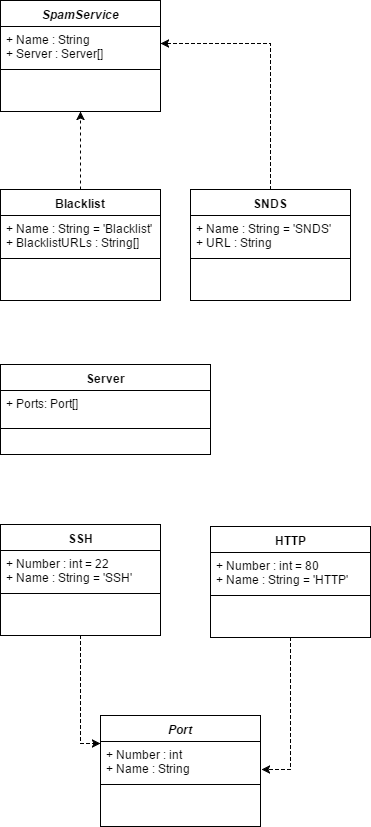
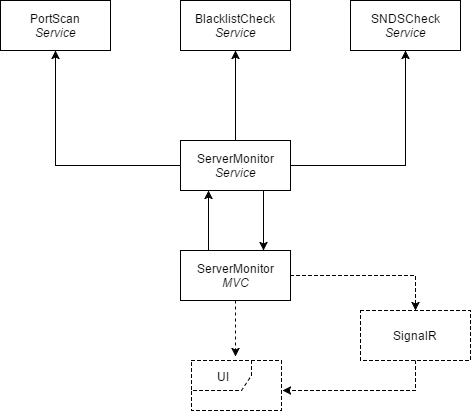

# ServerMonitorShared
This repository contains objects that can be used in one of the following projects:
 - [Soneritics/ServerMonitorService](https://github.com/Soneritics/ServerMonitorService)
 - [Soneritics/ServerMonitorWeb](https://github.com/Soneritics/ServerMonitorWeb)
 - [Soneritics/ServerMonitorShared](https://github.com/Soneritics/ServerMonitorShared)
 - [Soneritics/BlacklistCheck](https://github.com/Soneritics/BlacklistCheck)
 - [Soneritics/PortScan](https://github.com/Soneritics/PortScan)
 - [Soneritics/SNDSCheck](https://github.com/Soneritics/SNDSCheck)

## Objects in the package

## What is this?
This repository contains shared objects, used to create a monitoring service.
Run and compile the repositories as mentioned above for a complete working server monitor.

The services and their relations are the following:
